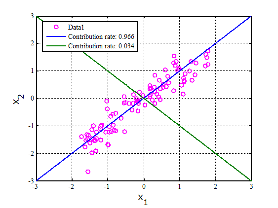
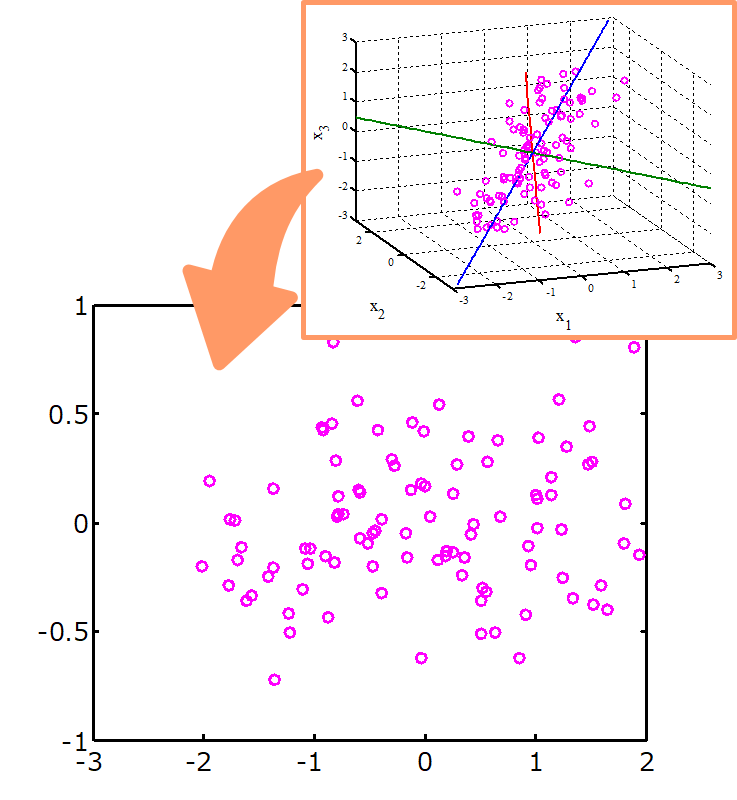

# 第六回B4輪講課題

## 課題の概要

本課題では，主成分分析を行う．

## 課題

1. 主成分分析して主成分を見つけよう！
2. 次元圧縮してみよう！

## 課題の進め方

1. データの準備
  - data1.csv, data2.csv, data3.csvの散布図をプロットして概形を確認
2. 主成分分析による主成分の算出（data1.csv, data2.csv, data3.csv）
  - 寄与率を計算
  - 主成分となる基底と散布図をプロット
3. 次元圧縮
  - 3次元データを2次元に次元圧縮（data2.csv）
    - 2次元データの散布図をプロット
  - 累積寄与率90%以上とすると何次元まで圧縮できるか（data3.csv）
4. 発表（次週）
  - 取り組んだ内容を周りにわかるように説明
  - コードの解説
    - 工夫したところ，苦労したところの解決策はぜひ共有しましょう
  - 結果の考察，応用先の調査など
  - 発表資料は研究室NASにアップロードしておくこと ( `/procyon/all/発表資料/B4輪講/2021/<発表日>` )

## 結果例





## 余裕がある人は

- 出来る限り可読性，高速化を意識しましょう
  - 冗長な記述はしていませんか
  - for文は行列演算に置き換えることはできませんか
- 関数は一般化しましょう
  - 課題で与えられたデータ以外でも動作するようにしましょう
  - N次元の入力にも対応できますか
- 処理時間を意識しましょう
  - どれだけ高速化できたか，`scipy`の実装にどれだけ近づけたか
  - pythonで実行時間を測定する方法は[こちら](http://st-hakky.hatenablog.com/entry/2018/01/26/214255)

## 注意

- 武田研究室の場合はセットアップで作成した`virtualenv`環境を利用すること  
  - アクティベート例：`source ~/workspace3/myvenv/bin/activate`  
  - アクティベート後`pip install ...`でライブラリのインストールを行う  
- 自分の作業ブランチで課題を行うこと
- プルリクエストを送る前に[REVIEW.md](https://github.com/TakedaLab/B4Lecture/blob/master/REVIEW.md)を参照し直せるところは直すこと
- プルリクエストをおくる際には**実行結果の画像も載せること**
- 作業前にリポジトリを最新版に更新すること

```
$ git checkout master
$ git fetch upstream
$ git merge upstresam/master
```
